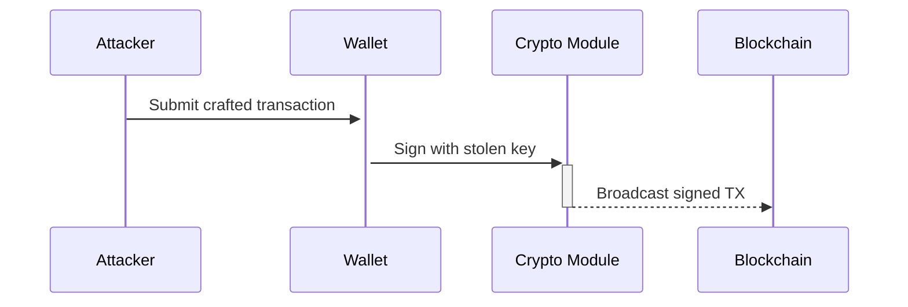

# Wallet Exfiltration & Cryptographic Analysis Tool

```python
"""
███╗   ██╗███████╗████████╗ █████╗ ██╗  ██╗███████╗██████╗ 
████╗  ██║██╔════╝╚══██╔══╝██╔══██╗██║ ██╔╝██╔════╝██╔══██╗
██╔██╗ ██║█████╗     ██║   ███████║█████╔╝ █████╗  ██████╔╝
██║╚██╗██║██╔══╝     ██║   ██╔══██║██╔═██╗ ██╔══╝  ██╔══██╗
██║ ╚████║███████╗   ██║   ██║  ██║██║  ██╗███████╗██║  ██║
╚═╝  ╚═══╝╚══════╝   ╚═╝   ╚═╝  ╚═╝╚═╝  ╚═╝╚══════╝╚═╝  ╚═╝
"""
```

---

## **README – Red Team Crypto Wallet Exfiltration Framework**

*Author: clasikpaige*  
*Repo: github.com/clasikpaige/netaker*  
*Modules: `netaker.py`, `decryptor.py`*  
*Purpose: Full-chain compromise simulation of self-custody wallets across platforms*

---

## **1. System Architecture**

### **1.1 Component Flow**

```mermaid
graph TD
    A[Malicious Payload (PDF, HTA, Macro, iOS)] -->|Execution| B[File Exfiltration Engine]
    B --> C[Central Data Folder (/data/exfil)]
    C --> D[decryptor.py]
    D --> E[Brute-Force Engine]
    E --> F[Private Key Recovery]
    F --> G[Transaction Signing (ECDSA)]
```

---

## **2. Workflow Overview**

| Phase        | Tool Component       | File Target              | Result                        |
|--------------|----------------------|---------------------------|-------------------------------|
| Delivery     | Embedded Payload     | PDF, HTA, Macro, PWSH     | Code Execution                |
| Exfiltration | `netaker.py` FS Scan | Wallet, keystore, mobile  | File dumped to `/data/`       |
| Analysis     | Pattern Extractor    | *.json, *.ldb             | Parsed for `crypto` structure |
| Decryption   | `decryptor.py`       | Encrypted key             | Plaintext key (if cracked)    |
| Signing      | ECDSA Module         | Transaction payload       | Simulated unauthorized tx     |

---

## **3. Wallet Structure**

```json
{
  "crypto": {
    "cipher": "aes-128-ctr",
    "ciphertext": "7b227665...",
    "kdf": "pbkdf2",
    "salt": "d4e5f6...",
    "iterations": 262144
  }
}
```

---

## **4. Brute-Force Flow (decryptor.py)**

```python
def brute_force(encrypted, salt, iterations, wordlist):
    for pwd in wordlist:
        key = PBKDF2(pwd, salt, iterations, dkLen=32)
        try:
            plain = AES_decrypt(key, encrypted)
            if valid_key(plain): return plain
        except: continue
```

**Mathematical Flow:**

```
key = PBKDF2(password, salt, iterations)
plaintext = AES-CTR(key, ciphertext)
if SHA3(plaintext) == known_pubkey_hash → success
```

---

## **5. Transaction Risk Model**

### **5.1 Signing Sequence**



---

## **6. Platform Payloads (Integrated)**

- [x] PDF (JavaScript payload, JS-embedded)
- [x] HTA (Windows HTA loader)
- [x] Office Macro (Excel/Word VBA)
- [x] PowerShell dropper (obfuscated, multi-line)
- [x] Python (Linux/macOS)
- [x] iOS (Keychain enumeration and keystore dump)

Each one is generated inside `netaker.py` and saved under:

```
/data/exfil/
├── ios/
├── keystores/
├── logs/
└── brute_results/
```

---

## **7. Ethical Guidelines**

| Principle                 | Rule                                                    |
|---------------------------|----------------------------------------------------------|
| Do not attack real wallets | Use only on test wallets and lab environments           |
| Respect disclosure        | Report real-world flaws through CVE or vendor channels  |
| Secure log retention      | Encrypt all logs if saving results externally           |

---

## **8. Install & Run**

```bash
git clone https://github.com/clasikpaige/netaker
cd netaker
pip install -r requirements.txt

# Run interactive CLI
python3 netaker.py

# Run brute-force recovery
python3 decryptor.py --input ./data/exfil/keystores/
```

---

## **9. Test Workflow**

1. Generate test wallet with known password (e.g., Geth/Metamask)
2. Run `netaker.py`, choose payload
3. Deliver via PDF/HTA/USB/email
4. Extract exfil files from `/data/exfil/`
5. Run `decryptor.py` and attempt recovery

---

## **10. Future Expansion**

- GPU-accelerated brute-force (via Hashcat)
- Web3.js interface for auto-push TX
- Lattice-based recovery for weak mnemonic schemes
- UTXO scanner to flag stolen key use

---

## Credits

**clasikpaige** – Red team  and crypto offensive researcher
GitHub: [github.com/clasikpaige](https://github.com/clasikpaige)  
Docs powered by Mermaid.js, Markdown, and offensive imagination.
