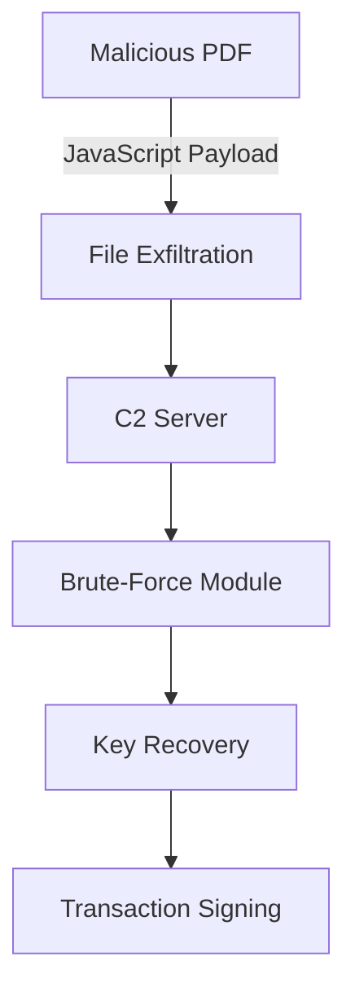
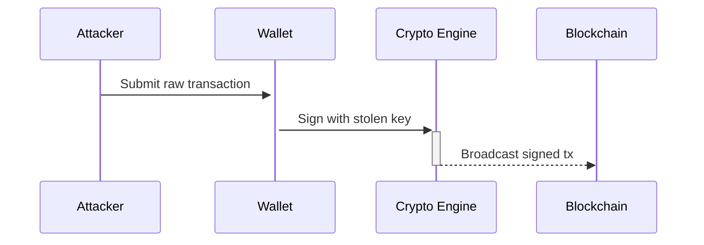

# Wallet Exfiltration & Cryptographic Analysis Tool


"""
███╗   ██╗███████╗████████╗ █████╗ ██╗  ██╗███████╗██████╗ 
████╗  ██║██╔════╝╚══██╔══╝██╔══██╗██║ ██╔╝██╔════╝██╔══██╗
██╔██╗ ██║█████╗     ██║   ███████║█████╔╝ █████╗  ██████╔╝
██║╚██╗██║██╔══╝     ██║   ██╔══██║██╔═██╗ ██╔══╝  ██╔══██╗
██║ ╚████║███████╗   ██║   ██║  ██║██║  ██╗███████╗██║  ██║
╚═╝  ╚═══╝╚══════╝   ╚═╝   ╚═╝  ╚═╝╚═╝  ╚═╝╚══════╝╚═╝  ╚═╝
"""


```
## Technical Documentation: Wallet Exfiltration & Cryptographic Analysis Tool  ```

*Author: clasikpaige*  
*GitHub: github.com/clasikpaige*  

## **Abstract**  
This paper documents a proof-of-concept tool for analyzing security vulnerabilities in self-custody cryptocurrency wallets. The system demonstrates:  
1. File exfiltration via malicious PDFs  
2. Cryptographic analysis of extracted wallet data  
3. Brute-force attacks on encrypted keys  
4. Transaction signing risks with compromised keys  

---

## **1. Introduction**  
Self-custody wallets store encryption keys locally, creating attack surfaces for:  
- **File system breaches** (via malware/exploits)  
- **Cryptographic weaknesses** (poor key derivation)  
- **Transaction integrity risks** (malicious signing)  

This tool simulates real-world attacks for defensive research purposes.

---

## **2. System Architecture**  

### **2.1 Component Diagram**  


### **2.2 Workflow Table**  

| Stage | Technique | Target | Outcome |
|-------|-----------|--------|---------|
| Delivery | PDF JavaScript | User device | Initial compromise |
| Exfiltration | HTTP POST | Wallet files | Data collection |
| Analysis | Pattern matching | JSON/LDB files | Key identification |
| Decryption | Dictionary attack | Encrypted keys | Plaintext recovery |
| Exploitation | ECDSA signing | Blockchain | Unauthorized transactions |

---

## **3. Cryptographic Workflows**  

### **3.1 Key Storage Formats**  
Common wallet encryption schemes:  

```python
# Typical wallet.json structure
{
  "crypto": {
    "cipher": "aes-128-ctr",
    "ciphertext": "7b227665...",  # Encrypted private key
    "kdf": "pbkdf2",
    "salt": "d4e5f6...",
    "iterations": 262144
  }
}
```

### **3.2 Brute-Force Mathematics**  

For password `p` attempting to decrypt ciphertext `C`:  

1. **Key Derivation**:  
   ```
   key = PBKDF2(p, salt, iterations, dkLen=32)
   ```

2. **Decryption Attempt**:  
   ```
   plaintext = AES-CTR(key, C)
   ```

3. **Success Condition**:  
   ```
   ∃ p ∈ P : SHA3(plaintext) == known_public_key_hash
   ```

Where:  
- `P` = password dictionary  
- Computational complexity = `|P| × iterations`

---

## **4. Local Storage Risks**  

### **4.1 Attack Vectors**  
| Risk Factor | Impact | Mitigation |
|-------------|--------|------------|
| Clear-text keys | Immediate theft | Hardware encryption |
| Weak KDF parameters | Faster brute-force | Argon2id, >100k iterations |
| Predictable passwords | Dictionary attacks | Passphrase policies |

### **4.2 Data Protection Requirements**  
1. **Encryption-at-rest** for all wallet files  
2. **Memory hardening** against cold boot attacks  
3. **Filesystem permissions** (600 on Unix systems)  
4. **Secure deletion** of temporary files  

---

## **5. Transaction Signing Risks**  

### **5.1 Compromised Key Workflow**  


### **5.2 Technical Constraints**  
1. Encrypted keys **cannot** directly sign transactions  
2. Required decryption steps:  
   ```python
   def sign_transaction(encrypted_key, password):
       key = decrypt_key(encrypted_key, password)
       signature = ecdsa_sign(key, tx_hash)
       return signature
   ```

---

## **6. Implementation Details**  

### **6.1 Tool Components**  

#### **PDF Generator**  
- Embeds JavaScript for file system traversal  
- Targets:  
  ```javascript
  const WALLET_PATHS = [
    "~/Library/Application Support/*/keys.json",
    "%APPDATA%\\Ethereum\\keystore\\*.json"
  ]
  ```

#### **Brute-Force Module**  
```python
def brute_force(encrypted_data, wordlist):
    for password in wordlist:
        key = PBKDF2(password, salt, iterations)
        try:
            return AES_decrypt(key, encrypted_data)
        except:
            continue
```

---

## **7. Ethical Considerations**  

### **7.1 Responsible Disclosure**  
1. **Never test** on non-consenting systems  
2. **Report vulnerabilities** to wallet vendors  
3. **Follow** CVE disclosure guidelines  

### **7.2 Defensive Recommendations**  
- Use hardware wallets for key storage  
- Implement biometric decryption gates  
- Monitor for anomalous file access  

---

## **Appendix A: Installation**  
```bash
git clone https://github.com/clasikpaige/Netaker
cd Netaker
pip install -r requirements.txt
```

## **Appendix B: Testing Workflow**  
1. Generate test wallet with known password  
2. Run PDF exfiltration  
3. Verify brute-force success rate  
4. Document time-to-compromise metrics
